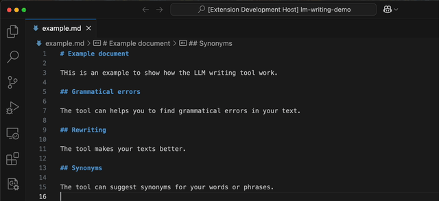

# LLM Writing Tool

After Grammarly disabled its API, there is no similar grammar checking tool for VSCode. While [LTeX](https://marketplace.visualstudio.com/items?itemName=valentjn.vscode-ltex) catches spelling mistakes, it does not reach the level of understanding that Grammarly does.

This extension is a simple attempt to fill the gap through large language models (LLM). It chunks the text into paragraphs, asks an LLM to proofread each paragraph, and then highlights the errors. The user can then click on the error to see the suggested correction.

## Features

- LLM-based grammar checking in American English
- Corrections via quick fixes
- Choose from local llama3.2:3b or gpt-40-mini through [VSCode LM api](https://code.visualstudio.com/api/extension-guides/language-model)
- Rewrite sections for clarity
- Get synonyms for expressions

## Commands

When the first command is initiated, a dialogue pops up for selecting between the local ollama model and the github copilot model. To use a local model, first [install and start a local ollama server](https://ollama.com/).

- "LLM writing tool: Start Text Check for Current Document": Continuously checks the text in the current document. Will show a prompt that asks to select an LLM model to use
- "LLM writing tool: Stop Text Check for Current Document": Stops checking the text in the current document

## Installation

1. Install the extension from the [VSCode Marketplace](https://marketplace.visualstudio.com/items?itemName=OlePetersen.lm-writing-tool)
2. Install [Ollama](https://ollama.com/) and pull llama3.2:3b for local grammar checking, or subscribe to GitHub Copilot to use an online model.

## How it works

The extension splits the text in sections and asks the LLM to proofread each section. These sections are then compared to the original text to find the changes made by the LLM.

## Roadmap

- [ ] On-disk caching of the LLM results to avoid repeated requests to the LLM API and faster startup times.
- [ ] Support for more languages. British English should be easiest to implement but in the future, any language supported by the LLM should be possible.
- [ ] Check out other models for better results. Prompts may have to be adjusted for different models.
